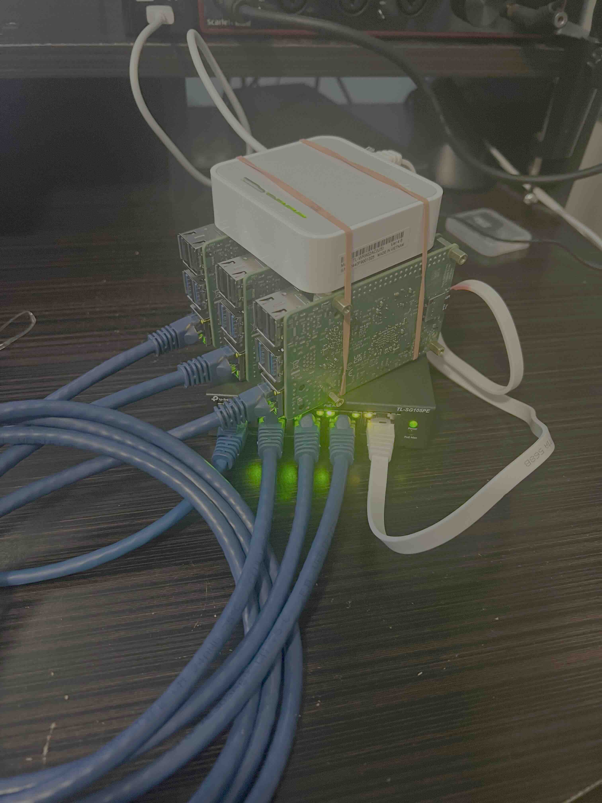
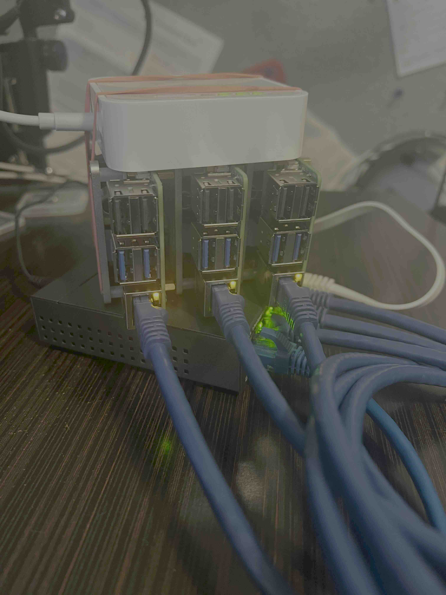
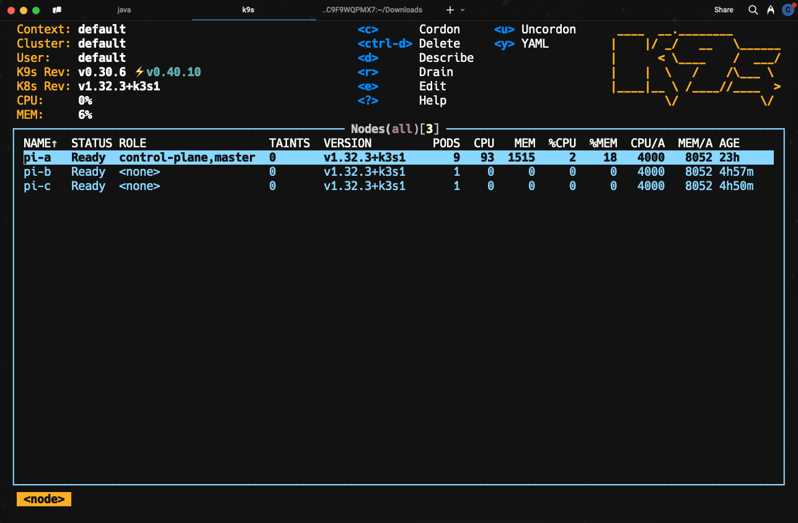
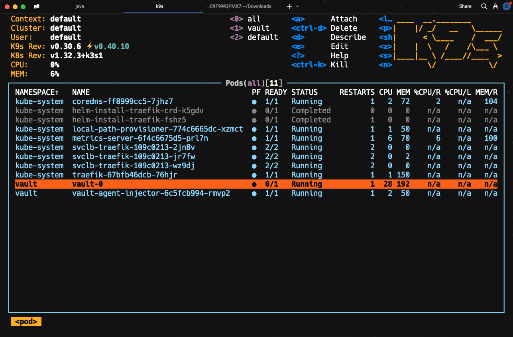

+++
date = '2025-03-28T20:52:09-04:00'
draft = true
title = 'Raspberry Pi Baremetal Cluster'
description = "Because I wanted to have a cluster with more than one node"
featured_image = 'pods.png'
+++

After hearing [Dashaun Carter](https://dashaun.com) talk about his Kubernetes cluster on Raspberry Pi on
[Spring Office Hours](https://spring-office-hours.transistor.fm/episodes)
, I was inspired to build my own. This project will document the steps I took to set up a Raspberry Pi cluster running
Kubernetes.

I wish I had gone to his blog to use [his cluster](https://dashaun.com/posts/k3s-on-raspberry-pi-clusterhat/) as
inspiration first--it looks very cool and was cheaper than mine!

# Why

I have been a Kubernetes fan-boy for a few years, but I don't have much in the way of hardware to run it at home.
I wanted something that I could experiment with. Plus I am planning to go for
a [Kubernetes certification](https://www.cncf.io/training/certification/cka/)
in the short
run and figured this would provide a useful playground environment.

# Inspiration

I inspired my cluster after[Anthony Simon's](https://anthonynsimon.com/blog/kubernetes-cluster-raspberry-pi/).
I especially liked the notion of powering it with Power over Ethernet (PoE) and using a network switch to simplify the
setup. I don't yet have a nifty case like Anthony's, but it's on my list of things to print on my Creality Ender 3.

# Bill of Materials
## Hardware
I was able to find almost everything at the local Micro Center. They were out of PoE hats so I had to resort to Amazon for those.

 Item                                                                                                                                                                                                               | Quantity | Unit Price (USD) | Total (USD) | 
--------------------------------------------------------------------------------------------------------------------------------------------------------------------------------------------------------------------|---------:|-----------------:|------------:|
 [Raspberry Pi 5 8GB](https://www.microcenter.com/product/673711/raspberry-pi-5)                                                                                                                                    |        3 |              $80 |        $240 |
 [MicroSD Card 32GB](https://www.microcenter.com/product/644257/32GB_MicroSDHC_Card_Class_10_Flash_Memory_Card_with_Adapter_-_2_Pack)                                                                               |        3 |               $7 |         $21 |
 [TP-Link PoE Switch](https://www.microcenter.com/product/694049/tp-link-tl-sg105pe-5-port-gigabit-poe-switch-4-poe-port-65w-easy-smart-plug-play-shielded-ports-support-qos,-vlan,-igmp-and-link-aggregation?rd=1) |        1 |              $60 |         $60 |
 [TP-Link Travel Router](https://www.microcenter.com/product/693943/tp-link-travel-router-ac750-wifi-5-dual-band-gigabit-wireless-router?rd=1)                                                                      |        1 |              $40 |         $40 |
 [Uctronics PoE Hat](https://www.amazon.com/dp/B0DBHFQ1TC?ref=ppx_yo2ov_dt_b_fed_asin_title)                                                                                                                        |        3 |              $22 |         $66 |
|                                                                                                                                                                                                                    |          |          *Total* |        $427 |

So yeah, I could have gone for a lower-end Pi to save some dough, but I wanted to  actually run some stuff on it, so I opted for the most memory I could get.

## Software

I imaged the SD cards with [Raspberry Pi Imager](https://www.raspberrypi.com/software/). Since 
I wanted the thinnest slice of host OS possible, I chose the smaller "lite" version of Raspberry Pi OS.

To install Kubernetes, I went with [K3s](https://k3s.io/), which is a lightweight version of Kubernetes. It is designed to be easy to install and run on resource-constrained devices like the Raspberry Pi.

Since I'd be tearing this down
and setting it back up multiple times, I put together some 
[ansible playbooks](https://github.com/cslauritsen/ansible-home/blob/eb9ddd4fa96f9a0a6578f2eefddbd36d5635fee2/site.yml#L1) to automate the process of preparing each node with pre requisites, 
installing a [shared 
token secret](https://github.com/cslauritsen/ansible-home/blob/eb9ddd4fa96f9a0a6578f2eefddbd36d5635fee2/playbooks/k3s-server.yaml#L10), 
installing a [control plane "server"](https://github.com/cslauritsen/ansible-home/blob/eb9ddd4fa96f9a0a6578f2eefddbd36d5635fee2/site.yml#L3)
and [2 "worker" nodes](https://github.com/cslauritsen/ansible-home/blob/eb9ddd4fa96f9a0a6578f2eefddbd36d5635fee2/site.yml#L4).

# Result
I really need to print that case to make this look better, 
for now, Heinen's rubber bands will have to do. 

Here is the cluster in all its glory:

